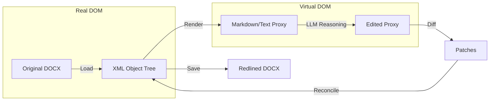

# Project Adeu: Technical Specification

## 1. Architectural Overview

Adeu operates on a **Document Reconciliation** strategy (Virtual DOM). Instead of converting a document to an intermediate format and trying to rebuild it from scratch, Adeu keeps the original XML structure intact and surgically injects `w:ins` (insert) and `w:del` (delete) tags based on differences found in a lightweight proxy (Markdown/Text).

 ### The Pipeline



## 2. Component Detail

### 2.1 Ingestion (`src/adeu/ingest.py`)
**Goal**: Provide text to the LLM that maps 1:1 with the underlying XML runs.
*   **Mechanism**: It does *not* use `docx.Paragraph.text`. Instead, it iterates over visible XML runs, resolving `<w:tab/>` and `<w:br/>` tags to prevent text merging.
*   **Structural Signals**: It detects Paragraph Styles and Outline Levels to inject "Virtual Markdown" (e.g., `# Header`) into the text stream. This gives the LLM structural context without modifying the document content.
*   **Content Controls (`w:sdt`)**:
    *   *Anchored Projection*: Leaf controls project anchor pairs `{#cc:N}`…`{#/cc:N}`. Open tokens carry flags (`locked`, `bound`, `group`). Empty fields display prompt text in `{>>placeholder: …<<}` bubbles in raw view. Checkboxes project as `[x]` / `[ ]`.
    *   *Fields Ledger*: `read_docx(mode="fields")` lists all form fields with ordinals, tags, aliases, classes, states, and option lists.
    *   *Field Editing & Gates*: `set_field` fills controls by `CC:N` ordinal, tag, or alias with type validation and dual-write to `customXml` or `core.xml`. Gated by control locks (`ignore_control_locks`), document protection (`ignore_document_protection`), and untracked writes (`allow_untracked_writes`).
*   **Comments**: DOCX Comments are ingested as **CriticMarkup** (`{==Text==}{>>Metadata: Comment<<}`). This preserves the precise scope of the comment and includes Author, Date, and Resolution status. Overlapping comments are flattened into sequential blocks.

### 2.2 The Mapper (`src/adeu/redline/mapper.py`)
**Goal**: Translate linear text offsets into XML elements.
*   **Challenge**: Word splits text arbitrarily (e.g., spellcheck breaks "Agreement" into `<w:r>Agree</w:r><w:r>ment</w:r>`).
*   **Solution**: The Mapper builds a linear index of every `Run` in the document. When an edit targets text at index 50-60, the Mapper identifies exactly which runs (or partial runs) contain that text.
*   **Run Splitting**: If an edit starts in the middle of a run, the Mapper splits the underlying XML element into two sibling runs (`_split_run_at_index`).

### 2.3 The Redline Engine (`src/adeu/redline/engine.py`)
**Goal**: Inject edits into the DOM.
*   **Indexed Editing**: Applies edits in **reverse order** (by index) to prevent index shifting.
*   **Style Heuristics**: When inserting text, the engine checks neighboring runs. If inserting a suffix, it mimics the previous run's style. If inserting a prefix (e.g., "Very " before "Important"), it mimics the next run's style.
*   **DOM Injection**: When inserting multi-line text, the engine splits the content and injects new `w:p` (Paragraph) elements into the document body, cloning the styling of the context paragraph.
*   **Comments**: Uses `CommentsManager` to manipulate the OPC package relationships, creating `word/comments.xml` if it doesn't exist.

### 2.4 The Diff Engine (`src/adeu/diff.py`)
**Goal**: Support "Full Rewrite" workflows.
*   If an Agent rewrites a whole paragraph instead of providing specific edits, the Diff engine compares `Original Text` vs `New Text`.
*   It uses `diff-match-patch` at a **word-level granularity** (encoding words as characters) to ensure changes are semantic (whole words) rather than character jumbles.

## 3. Data Structures

The system relies on the `DocumentEdit` schema defined in `src/adeu/models.py`.

```python
class ModifyText(BaseModel):
    type: Literal["modify"]
    target_text: str
    new_text: str
    comment: Optional[str]

class SetField(BaseModel):
    type: Literal["set_field"]
    field: str  # "CC:N", tag, or alias
    value: str
    match_mode: Optional[Literal["strict", "first", "all"]]
    comment: Optional[str]

class AcceptChange(BaseModel): ...
class RejectChange(BaseModel): ...
class ReplyComment(BaseModel): ...
class InsertRow(BaseModel): ...
class DeleteRow(BaseModel): ...

DocumentChange = Annotated[
    Union[AcceptChange, RejectChange, ReplyComment, ModifyText, SetField, InsertRow, DeleteRow, ...],
    Field(discriminator="type")
]
```

## 4. Project Structure

```text
|-- src/
    |-- adeu/
        |-- server.py           # FastMCP Server Entrypoint
        |-- ingest.py           # Text Extraction (Run-aware)
        |-- diff.py             # Word-level Diffing
        |-- models.py           # Pydantic Schemas
        |-- redline/
            |-- engine.py       # Main Logic / XML Injection
            |-- mapper.py       # Text -> XML Indexing
            |-- comments.py     # OXML Comments Management
        |-- utils/
            |-- docx.py         # Low-level XML Helpers
```

## 5. Known Limitations

1.  **Table Structure Changes**: Adeu supports inserting and deleting table rows (`insert_row`, `delete_row`), but cell merging and column deletion are not supported via the structured edit interface.
2.  **Complex Field Codes**: Edits inside complex field codes (like automated dates or TOCs) may result in broken fields.
